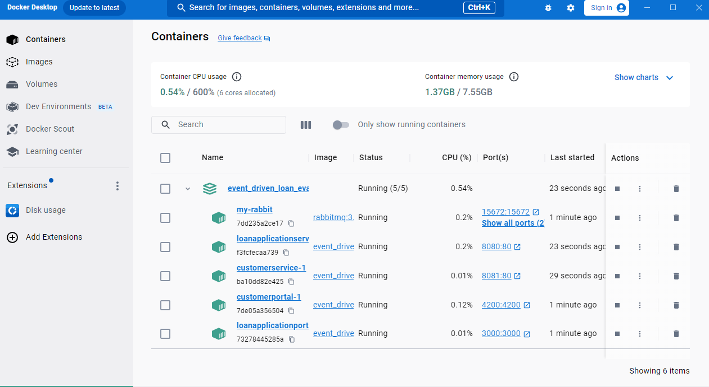

# LoanApplicationService

Welcome to VinNance Credit Loan Application Service Engine.

It is an .NET Core 8.0 Web API application that uses REST API to manage users and their loan applications.
It also comes with the Angular GUI application [Loan Application Service Portal](https://github.com/vinhngogia0906/Event_Driven_Loan_Evaluation/tree/main/loan-application-portal).

## Getting Started
This is how you set up and run the project locally in your environment.

1. Make sure you follow the master README [here](https://github.com/vinhngogia0906/Event_Driven_Loan_Evaluation) first and you get all the Docker services running.
2. Click the loanapplicationservice service or navigate to `http://localhost:8080/` with the browser to access the application.

3. A browser tab will be open and you will see the Swagger playground GUI where you can examine the schema and all the API Documentation if you nagivate to `http://localhost:8080/swagger/index.html`.
