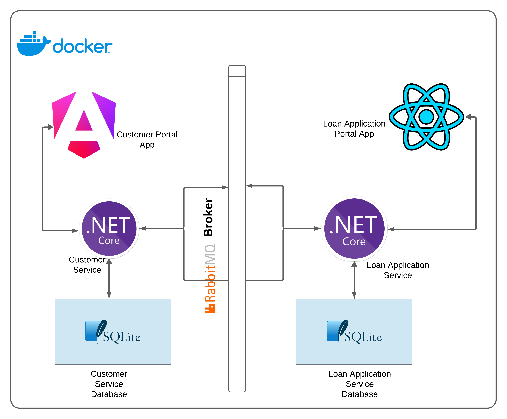
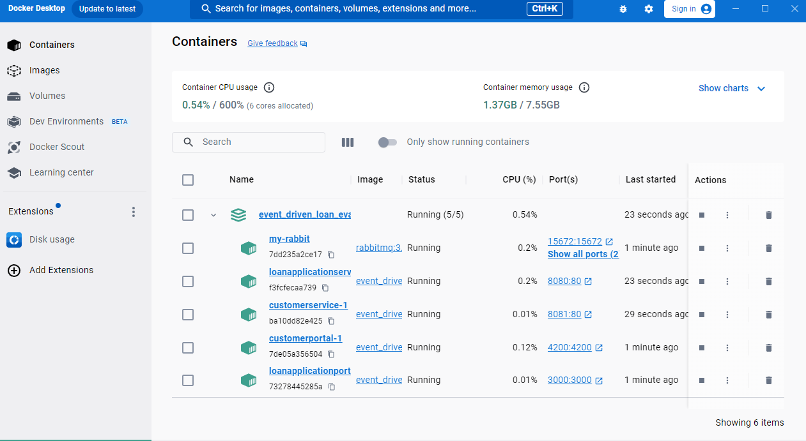

# Event_Driven_Loan_Evaluation
This is [Vinh Ngo](https://github.com/vinhngogia0906) attempt to learn about event-driven architecture in .NET by building a Loan Evaluation platform.

## This platform contains 6 separate applications:

1. [Customer Service](https://github.com/vinhngogia0906/Event_Driven_Loan_Evaluation/tree/main/CustomerService)
  This is the backend .NET Core Web API application written in C# .NET Core 8.0 that uses RESTful API to manage user and user's loan application for the independent Customer Service.
2. [Loan Application Service](https://github.com/vinhngogia0906/Event_Driven_Loan_Evaluation/tree/main/LoanApplicationService)
  This is the backend .NET Core Web API application written in C# .NET Core 8.0 that uses RESTful API to manage loan application for the independent Loan Application Service.
3. [Customer Service Portal](https://github.com/vinhngogia0906/Event_Driven_Loan_Evaluation/tree/main/customer-portal-app)
  This project was generated with [Angular CLI](https://github.com/angular/angular-cli) version 19.2.6 and serves as the frontend application for [Customer Service](https://github.com/vinhngogia0906/Event_Driven_Loan_Evaluation/tree/main/CustomerService) application.
4. [Loan Application Service Portal](https://github.com/vinhngogia0906/Event_Driven_Loan_Evaluation/tree/main/loan-application-portal)
This project was bootstrapped with [Create React App](https://github.com/facebook/create-react-app), has Typescript as the language and serves as the frontend application for [Loan Application Service](https://github.com/vinhngogia0906/Event_Driven_Loan_Evaluation/tree/main/LoanApplicationService) application.
5. [Customer Service Test](https://github.com/vinhngogia0906/Event_Driven_Loan_Evaluation/tree/main/CustomerServiceTest)
  This is the xUnit application for unit testing the [Customer Service](https://github.com/vinhngogia0906/Event_Driven_Loan_Evaluation/tree/main/CustomerService), its test cases are also run by the Git Action CI process whenever the `main` branch changes.
6. [Loan Application Service Test](https://github.com/vinhngogia0906/Event_Driven_Loan_Evaluation/tree/main/LoanApplicationServiceTest)
This is the xUnit application for unit testing the [Loan Application Service](https://github.com/vinhngogia0906/Event_Driven_Loan_Evaluation/tree/main/LoanApplicationService), its test cases are also run by the Git Action CI process whenever the `main` branch changes.

## Platform infrastructure:


## Getting Started
This is how you set up and run the project locally in your environment.
1. Download and set up Docker [here](https://docs.docker.com/get-started/get-docker/).
2. Clone the repository
```
git clone https://github.com/vinhngogia0906/Event_Driven_Loan_Evaluation.git
```
3. In the repository, run this command to build and spin up the platform's Docker containers:
```
docker-compose up -d
```
4. Wait for the RabbitMq service to finish spinning up (the disk usage will go down drastically), then start the two service applications and finally start the two portal applications. Make sure all the services are running before testing.

5. Follow the instructions in the README files of the Customer Service Portal and Loan Application Portal applications to start using the Loan Evaluation Platform.
  - [Customer Service Portal](https://github.com/vinhngogia0906/Event_Driven_Loan_Evaluation/tree/main/customer-portal-app)
  - [Loan Application Service Portal](https://github.com/vinhngogia0906/Event_Driven_Loan_Evaluation/tree/main/loan-application-portal) 
