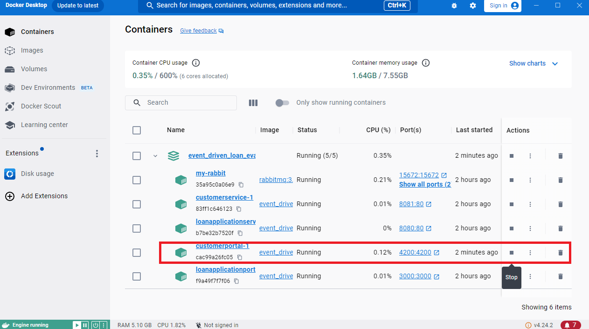

# CustomerPortalApp
Welcome to the VinNance Credit Customer Service Portal Application.
This project was generated using [Angular CLI](https://github.com/angular/angular-cli) version 19.2.4 and serves as the frontend application for [Customer Service](https://github.com/vinhngogia0906/Event_Driven_Loan_Evaluation/tree/main/CustomerService).

## Getting Started
This is how you set up and run the project locally in your environment.

1. Make sure you follow the master README [here](https://github.com/vinhngogia0906/Event_Driven_Loan_Evaluation) first and you get all the Docker services running.
2. Click the customerportal service or navigate to `http://localhost:4200/` with the browser to access the application.

3. Sign in or Sign up if you don't have a user credentials


4. Submit New Loan.

5. Cancel the loan to run away.


## Development server

To start a local development server, run:

```bash
ng serve
```

Once the server is running, open your browser and navigate to `http://localhost:4200/`. The application will automatically reload whenever you modify any of the source files.

## Code scaffolding

Angular CLI includes powerful code scaffolding tools. To generate a new component, run:

```bash
ng generate component component-name
```

For a complete list of available schematics (such as `components`, `directives`, or `pipes`), run:

```bash
ng generate --help
```

## Building

To build the project run:

```bash
ng build
```

This will compile your project and store the build artifacts in the `dist/` directory. By default, the production build optimizes your application for performance and speed.

## Running unit tests

To execute unit tests with the [Karma](https://karma-runner.github.io) test runner, use the following command:

```bash
ng test
```

## Running end-to-end tests

For end-to-end (e2e) testing, run:

```bash
ng e2e
```

Angular CLI does not come with an end-to-end testing framework by default. You can choose one that suits your needs.

## Additional Resources

For more information on using the Angular CLI, including detailed command references, visit the [Angular CLI Overview and Command Reference](https://angular.dev/tools/cli) page.
